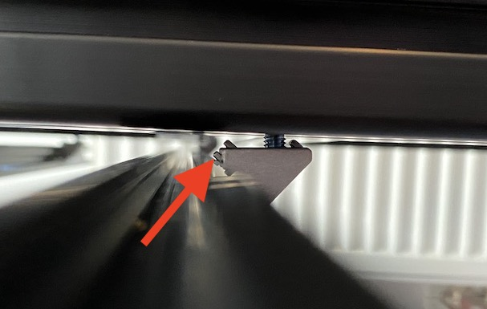

# SIMRIG SR1
How to install the SIMRIG SR1 without turning your rig upside down.

If, like me, you buy the SIMRIG SR1 to install on a rig that's already in use, it's quite a lot of work to disassemble everything and turn the rig upside down. That's why I installed it right side up. Below you can find a guide on how to do this. I have done this on a Sim-Lab TR1, but it should be the same for any 8020 rig.

## Disclaimer

**This way of installing the SIMRIG SR1 is a lot more dangerous than the procedure described in the user manual. If your rig is not correctly supported or you hit it hard while moving around underneath it might lead to serious injury! Proceed at your own risk and be very careful!**

## Required tools
In order to do the installation, besides the tools required for the normal install you will need 4 axle stands that normally are used to support a car in the workshop.

Putting the rig on the stands and lowering it requires help from a second person.

An electric screwdriver will also save you some time.

## Lifting the rig
Since my DD wheel is quite heavy (15kg), the steering wheel would be annoying be while installing the motion platform and it's only 3 bolts, I did remove the steering wheel.

Next I put my rig on the axle stands by first lifting the rear, installing 2 stands at the back, and then lifting the front and installing 2 stands in the middle somewhere. You need 2 people to do this. Attention! I realised later on that I shouldn't have put the back stands so far back. I moved them further forwards as they are interfering with the installation of rear bar. You will see later that I moved them. I suggest to scroll down and see where I put them.

The higher you set it, the easier it will be to work under it. I wouildn't go any lower than what I used.

Once you are done it looks like this

As previously stated, I moved the rear stands forwards in order to install the rear bars. Move them at least 20cm from the back of the rig, so you have room to work. 

## Installing the bars

In the instruction manual it states: 

`Each 20x20 aluminum bar is attached to the rig with two 20mm angle brackets. Brake off one alignment pin on each bracket (use a scewdriver.) `

After some trial and error I found 2 issues with the brackets:
- Breaking off one alignment pin is not enough. You need to remove two.

- The holes in the brackets are too small for the screws. With a bit of fiddling you can get the screws to thread through, but since we want to align everything exactly against the rig we have a problem here as the screw cannot slide in the hole.

Here is how I solved both issues:

### Alignment pins

There are two sides to the bracket. One goes on the big profiles of your rig, one on the small profiles of the SIMRIG SR1. You need to remove the alignment pins that touch the small profile. First you need to remove one at the top, and then on the same side you remove the bottom one. The easiest way of doing this is with 2 pliers. If you don't you will not be able to bolt the small profile against the profile of your rig as you can see below

So take some big pliers, hold the bracket, and use the small pliers to break off the 2 guide pins (it does not require a lot of force).

### Bracket holes too narrow

As you can see, the bolt is stuck inside the bracket. It has no way to slide up and down. We need to solve this so we can put the profile against our rig. This only needs to be done on one side, the side where we removed the guide pins. Just use a small file and open the hole. The material is quite soft and in less than 10 seconds per size the hole will be big enough so the bolt can move freely. Test with one of the M5x14 ones. They are easier to test with than the M5x8 that will need to be used when installing.

### Preparing the bars

Install the brackets on the 4 profiles. Don't tighten them, just make sure they can't fall out. Use the M5x8. Using an electric screwdriver to thread the M5x14 through the other part of the bracket (or use your newly acquired filing skills if you prefer to). Doing this by hand is also possible but takes more time. With the electric screwdriver make sure to go all the way in and then keep on turning for few seconds so the bolt can spin freely inside the bracket. (You can move the electric screwdriver to the side now, it's no longer needed after this).

### Installing the bars on the rig

As explained in the original documentation, install the 4 bar without tightening them on the rig. The most important thing to know is that the outer distance between the first and the last bar should be 780mm, and that the rear bar should be aligned with the rear of your rig.

What I did was I did tighten the rearmost bar (the 2 bolts that go into your rig, the short ones in the small profile aren't tightened so you can slide the profile left-right) and I also tightened the frontmost one, so the 780mm distance was assured (again only on the rig, not the small profile, that should be able to slide left-right).

The 2 middle bars were installed but not tightened.

To make tightening everything after installation more easy, I would suggest putting the brackets on the outside of the bars, so you have more room for a screwdriver or other tools. This of course is not possible for the bar at the rear.

The arrows show where the brackets are

## Motor installation

To install the motors on the bars you will need these:

The hard part is that you need to slide in the nuts on the bottom and then screw the motor screws also from the bottom. Extremely difficult if you don't turn the rig upside down. Fortunately there is an easier way of doing this. 

First screw the pads under the motor.

Next install the 4 screws from the bottom and screw them in the t slot nuts. Attention! Only screw them a very small distance. Just enough so they don't fall out when you wiggle them around. Do not tighten them all the way down!

Now install them on the rig. We'll start at the front. Remember that the frontmost bar was tightened so it can't move forward backward, only left-right. Push the screws all the way up from the bottom and slide the t nuts in the frontmost bar. This will take a bit of fiddling but isn't very hard to do. 

In order to get the 2 t nuts at the back of the motor in the back bar, we will do it the opposite way. Remember that the 2nd bar is loose. First slide it all the way in, towards the side of the rig opposite from you. (as you are sitting in front of the bar, it means pushing it away from you). Next align the bar with the t nuts by moving it left-right (or front-back if you view it relative to your rig) and pull the bar back over those t nuts. 

This is how it looks:

