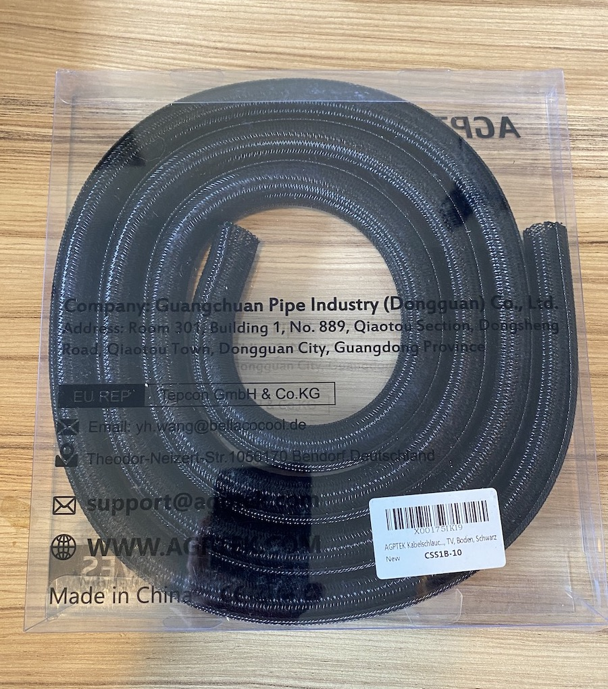
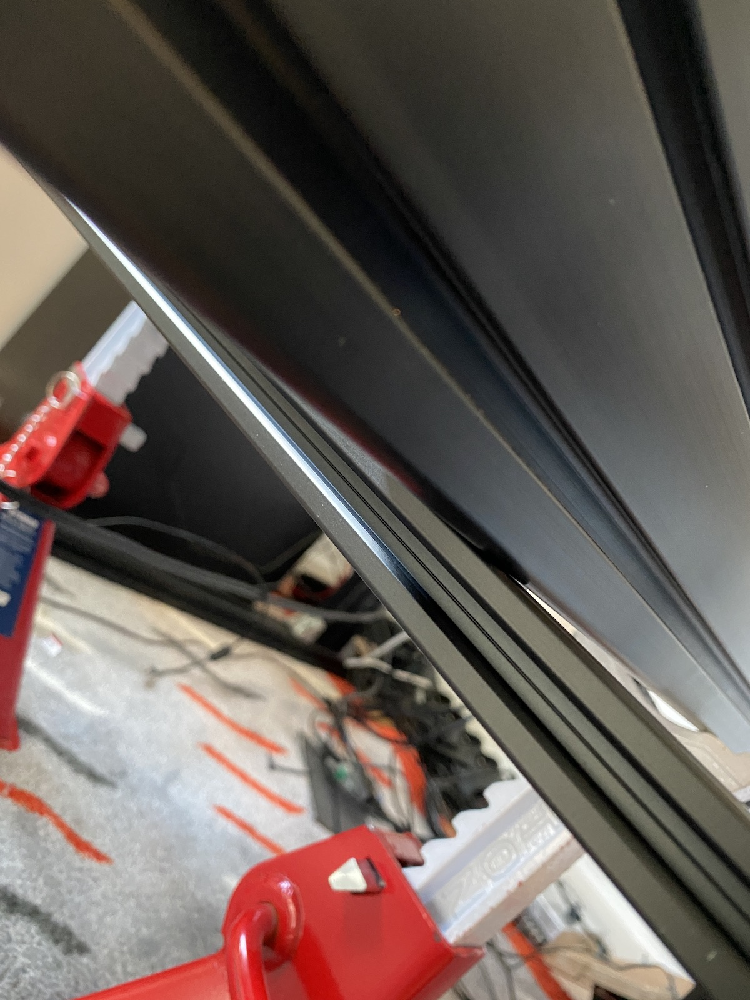
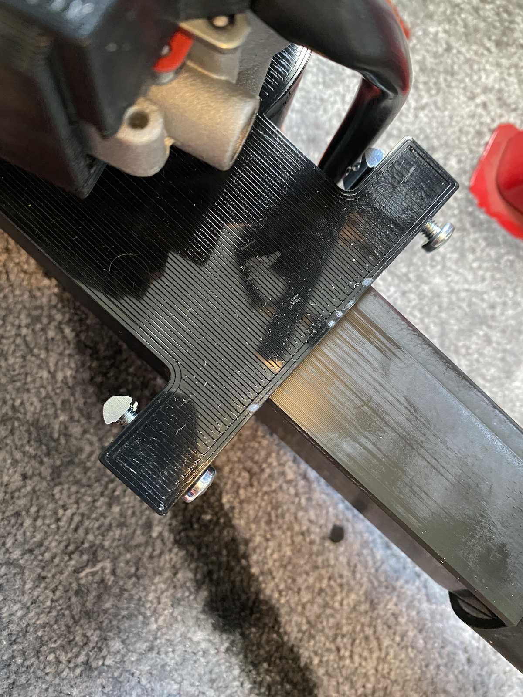
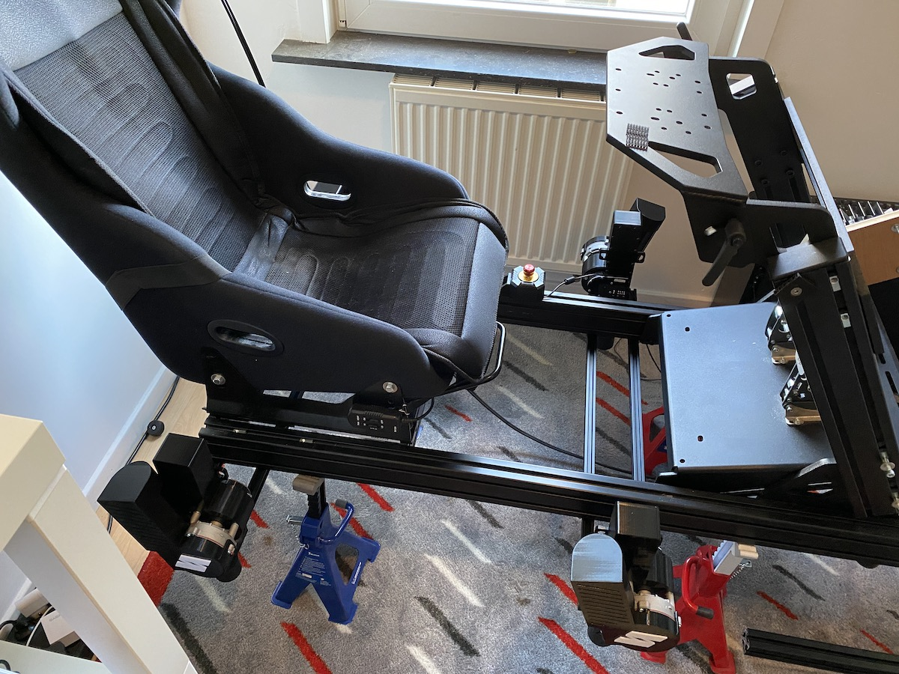
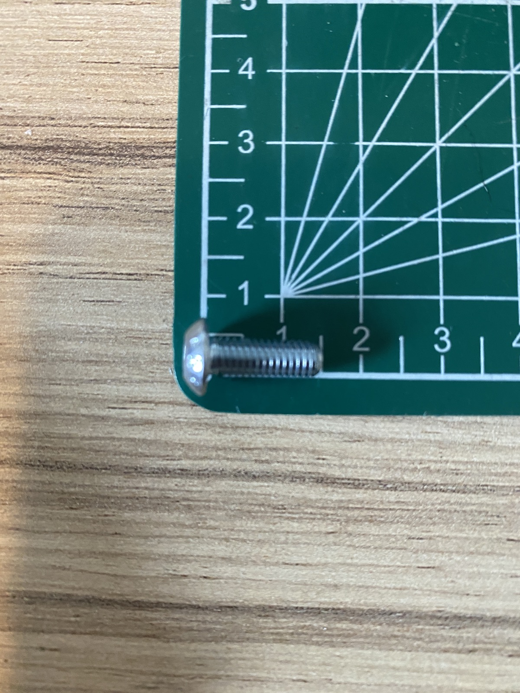

# SIMRIG SR1
How to install the SIMRIG SR1 without turning your rig upside down.

If, like me, you buy the SIMRIG SR1 to install on a rig that's already in use, it's quite a lot of work to disassemble everything and turn the rig upside down. That's why I installed it right side up. Below you can find a guide on how to do this. I have done this on a Sim-Lab TR1, but it should be the same for any 8020 rig.

Please first read through the original instruction guide as the below instructions will not contain all the details, especially concerning electronics.

https://simrig.se/documentation/sr1/assembly.html

## Disclaimer

**This way of installing the SIMRIG SR1 is a lot more dangerous than the procedure described in the user manual. If your rig is not correctly supported or you hit it hard while moving around underneath it might lead to serious injury! Proceed at your own risk and be very careful!**

## Required tools
In order to do the installation, besides the tools required for the normal install you will need:

- 4 axle stands that normally are used to support a car in the workshop.

- a needle file. 

- an electric screwdriver

- a toolcase with sockets

- some Allen keys

- cable sleeves

- 250mm tie wraps

## Lifting the rig
Putting the rig on the stands and lowering it requires help from a second person.

Since my DD wheel is quite heavy (15kg), the steering wheel would be annoying be while installing the motion platform and it's only 3 bolts, I did remove the steering wheel.

Next I put my rig on the axle stands by first lifting the rear, installing 2 stands at the back, and then lifting the front and installing 2 stands in the middle somewhere. You need 2 people to do this. Attention! I realised later on that I shouldn't have put the back stands so far back. I moved them further forwards as they are interfering with the installation of rear bar. You will see later that I moved them. I suggest to scroll down and see where I put them.

The higher you set it, the easier it will be to work under it. I wouildn't go any lower than what I used.

Once you are done it looks like this

As previously stated, I moved the rear stands forwards in order to install the rear bars. Move them at least 20cm from the back of the rig, so you have room to work. 

## Installing the bars

In the instruction manual it states: 

`Each 20x20 aluminum bar is attached to the rig with two 20mm angle brackets. Brake off one alignment pin on each bracket (use a scewdriver.) `

After some trial and error I found 2 issues with the brackets:
- Breaking off one alignment pin is not enough. You need to remove two.

- The holes in the brackets are too small for the screws. With a bit of fiddling you can get the screws to thread through, but since we want to align everything exactly against the rig we have a problem here as the screw cannot slide in the hole.

Here is how I solved both issues:

### Alignment pins

There are two sides to the bracket. One goes on the big profiles of your rig, one on the small profiles of the SIMRIG SR1. You need to remove the alignment pins that touch the small profile. First you need to remove one at the top, and then on the same side you remove the bottom one. The easiest way of doing this is with 2 pliers. If you don't you will not be able to bolt the small profile against the profile of your rig as you can see below

So take some big pliers, hold the bracket, and use the small pliers to break off the 2 guide pins (it does not require a lot of force).

### Bracket holes too narrow

As you can see, the bolt is stuck inside the bracket. It has no way to slide up and down. We need to solve this so we can put the profile against our rig. This only needs to be done on one side, the side where we removed the guide pins. Just use a small file and open the hole. The material is quite soft and in less than 10 seconds per size the hole will be big enough so the bolt can move freely. Test with one of the M5x14 ones. They are easier to test with than the M5x8 that will need to be used when installing.

### Preparing the bars

Install the brackets on the 4 profiles. Don't tighten them, just make sure they can't fall out. Use the M5x8. Using an electric screwdriver to thread the M5x14 through the other part of the bracket (or use your newly acquired filing skills if you prefer to). Doing this by hand is also possible but takes more time. With the electric screwdriver make sure to go all the way in and then keep on turning for few seconds so the bolt can spin freely inside the bracket. (You can move the electric screwdriver to the side now, it's no longer needed after this).

### Installing the bars on the rig

As explained in the original documentation, install the 4 bar without tightening them on the rig. The most important thing to know is that the outer distance between the first and the last bar should be 780mm, and that the rear bar should be aligned with the rear of your rig.

What I did was I did tighten the rearmost bar completely and I also tightened the frontmost one, so the 780mm distance was assured. The 2 middle bars were installed but not tightened. Read below on how to tighten correctly.

To make tightening everything after installation more easy, I would suggest putting the brackets on the outside of the bars, so you have more room for a screwdriver or other tools. This of course is not possible for the bar at the rear.

The arrows show where the brackets are

Measure how much the bars stick out on each side so you can move them around to get them centered left-right. For the 2 middle bars this is not important but for the frontmost and rearmost it is as they will be tightened down.

To tighten the bars there is something very important that you need to do! Tightening the M5x14's into the frame of the rig is nothing special, but once this is done and you want to tighten the small bars to the bracket, you must, with your hand, clamp the bar firmly against the big bar of the rig (that's why the bolt needs to be able to move freely up and down and the guide pins needed removal). This to assure that your rig will rest on the small bars, and not rest on the bolts that were used to tighten it down.

There should be zero empty space between your rig and the small bar.

## Motor installation

To install the motors on the bars you will need these:

The hard part is that you need to slide in the nuts on the bottom and then screw the motor screws also from the bottom. Extremely difficult if you don't turn the rig upside down. Fortunately there is an easier way of doing this. 

First screw the pads under the motor.

Next install the 4 screws from the bottom and screw them in the t slot nuts. Attention! Only screw them a very small distance. Just enough so they don't fall out when you wiggle them around. Do not tighten them all the way down!

Now install them on the rig. We'll start at the front. Remember that the frontmost bar was tightened so it can't move. Push the screws all the way up from the bottom and slide the t nuts in the frontmost bar. This will take a bit of fiddling but isn't very hard to do. 

In order to get the 2 t nuts at the back of the motor in the back bar, we will do it the opposite way. Remember that the 2nd bar is loose. First slide it all the way in, towards the side of the rig opposite from you. (as you are sitting in front of the bar, it means pushing it away from you). Next align the bar with the t nuts by moving it left-right (or front-back if you view it relative to your rig) and pull the bar back over those t nuts. 

This is how it looks:

Tighten the screws a little bit more so they don't fall out but the motor should still be able to move around freely.

Now do the same for the motor at the back.

We need to do the opposite side. To make this easier slide the small bar further over the motor that is already installed. 

Attention! If you find it hard to move the bar it could be stuck on the motor cable. Move it out of the way and don't damage it by pushing too hard with the bar!

Since the distance is already ok between the bars you simply install the nuts in the fixed bar and pull the other one over the nuts once it's done.

Done!

## Installing the supports between the motor and the rig

The t nut and bolt that is used to bolt the clamp on the rig is this one

The screws and nuts you need to attach the clamp to the motor are these

First install the clamp on the rig, without tightening it down. Next slide the motor towards the rig and align everything. Remember what has been stated above concerning the motor cable! Do not force it, it should slide smoothly.

Next attach the clamp to the motor

If like me your seat is still installed you will need to special tools to access everything. If your seat is on a slider maybe you can slide it forwards, but be very careful as it usually requires a lot of force and you might pull your rig from the axle stands!

Note that the nuts used here are self-locking. There is absolutely no need to tighten them down with a lot of force. As soon as everything is tightened together it's ok. It will not loosen due to vibrations thanks to the plastic inside the locking nut, so be gentle.

Repeat for the 3 other motors. The 2 at the front will be easier as the seat is not in the way.

Once this is done you can tighten:
- the big M8 screws that attach the clamps to the rig
- the 4 bottom screws holding the motor, for each motor.
- all the bolts holding the bars. Remember to clamp the small bars against your rig when tightening the M5x8 screws!

## Electronics

I installed the electronics box under my seat using the following 2 screws. Make sure you orient the box correctly (power and USB port to the left hand side of the rig)

Follow the instructions on the SIMRIG website to connect all the wires.

## Emergency stop

Open the emergeny stop button by removing the 4 screws, and use the following screws (and compatible t nut) to fix the stop button on the rig. Just insert the 2 screws in the holes inside the casing. Beware that you'll need a long Allen key for this.

## Wiring

There are a lot of long wires included in the system, and in order to keep things clean I like to tidy up the wiring so no wires are seen from the outside of the rig.

I cut some parts of the cable sleeves to wrap the front part of the wiring of the front motors.

I routed the wires inside the bar of the frame, on the bottom.

Then I routed the wires in the side of the frame, on the inside, to the the small bar at the and attached it there before returning to the electronics box. The wires coming from the back motor do a loop before being attached to the back bar and going to the electronics module. 

Make sure there is no tension anywhere in the system. As long as everything stays in place it's ok, no need to make sharp corners with the wires or have strain on the plugs.

The power and usb wire are routed in the side bar of the rig. Here you can see where they are supposed to go. I didn't finish inserting them there all the way as I first wanted to test the system before cleaning up all the wiring.

## The end

That's it. Get someone to help you move the axle stands from the rig (first the front ones, then the rear ones) and move your rig where it's supposed to be, plug in all the cables and enjoy!

